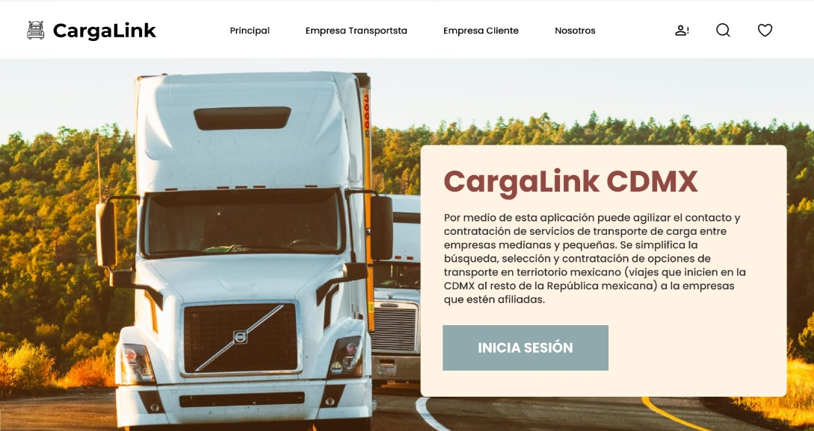

# CargaLink CDMX Frontend
Frontend of **CargaLink CDMX**, a web application developed as part of a **Bachelor’s Thesis at ESCOM (IPN)**.  
The system connects SME freight transport companies with businesses requiring cargo services in Mexico City.  

This repository contains the **Angular-based frontend** that provides a responsive and user-friendly interface for interacting with the backend APIs. It includes modules for authentication, cargo management, trip handling, AI-powered recommendations, chatbot support, and real-time chat.

---
## Project Overview

CargaLink CDMX streamlines the process of finding and hiring freight transport services.  
It reduces the dependence on intermediaries, promotes transparency, and fosters fair competition among transport companies.  

It is built with **Angular** and styled with **Bootstrap**, ensuring cross-device compatibility and scalability for future mobile and desktop implementations.

You can find the backend repository [here](https://github.com/Shutman-ZTAY/CargaLink-BackEnd/)
You can find the ai repository [here](https://github.com/H4d3rach/cargalink-ai/)

## User Roles

The system supports **role-based access control (RBAC)** with four main roles:

1. **Administrator**  
   - Full access to the platform.  
   - Manages all users, companies, cargos, and trips.  

2. **Transport Company Representative (RepTrans)**  
   - Manages the company, transportists, trucks, and trailers.  
   - Applies to cargos published by clients.  
   - Configures trips by assigning resources (driver, truck, semi-trailer).  
   - Handles unexpected issues (accidents, problems) and reallocates resources.  

3. **Client Representative (RepCli)**  
   - Publishes cargo offers to be transported (currently limited to *general cargo*).  
   - Cannot request hazardous materials, construction materials, or liquids (*future work*).  
   - Selects and contracts transport companies directly.  

4. **Transportist (Driver)**  
   - Executes assigned trips.  
   - Updates trip status: *scheduled → picking up → loading → en route → delivering → delivered*.  
   - Can report problems during trips.  
   - Communicates with other users via the chat module.  

---
## Features

- **Authentication & Role Management**  
  Login and registration flows connected to the backend’s JWT authentication.  
  User dashboards adapt to role permissions (Admin, RepTrans, RepCli, Transportist).

- **Cargo Publication & Search**  
  Client representatives can publish cargo offers.  
  Transport companies can browse and apply for cargos.
  Client can select the best transport company according to its needs.
  Transport companies will be display in order to client preferences.

- **Trip Management**  
  Interfaces for creating, assigning, and updating trip status (scheduled, picking up, loading, en route, delivering, delivered).  
  Transportists can easily update progress in real time.

- **Chat Module**  
  Real-time messaging between:  
  - RepCli ↔ RepTrans  
  - RepTrans ↔ Transportists  
  - Transportists ↔ Transportists (same company)  

- **Ratings & Recommendations**  
  UI for rating transport companies and viewing **AI-based recommendations** (cosine similarity & preference vectors).

- **Chatbot Support**  
  Integrated FAQ chatbot to guide users and reduce resistance to new technologies.

- **Responsive UI**  
  Built with Bootstrap for a consistent experience on desktop, tablet, and mobile.

---

## Tech Stack

- **Framework:** Angular  
- **Styling:** Bootstrap + SCSS  
- **State Management:** Angular Services  
- **HTTP Client:** Angular HttpClient (REST API consumption)  
- **Real-time Chat:** WebSocket integration  
- **Build Tool:** Angular CLI  

---

This project was generated with [Angular CLI](https://github.com/angular/angular-cli) version 17.3.9.

## Development server

Run `ng serve` for a dev server. Navigate to `http://localhost:4200/`. The application will automatically reload if you change any of the source files.

## Code scaffolding

Run `ng generate component component-name` to generate a new component. You can also use `ng generate directive|pipe|service|class|guard|interface|enum|module`.

## Build

Run `ng build` to build the project. The build artifacts will be stored in the `dist/` directory.

## Future work
- Extend cargo types (hazardous materials, liquids, construction).
- Integrate real payment gateway.
- Improve chat reliability and scalability.
- Enhance recommendation system with advanced ML models.
- Expand coverage to all of Mexico.
- Modules: Rent Truck, Rent Trailer, Contract Transportist

---
## Contact
- Developed as a Bachelor’s Thesis project at the Escuela Superior de Cómputo (ESCOM - IPN)
- Under the supervision of M. en C. Gabriela de Jesús López Ruíz.
- Developers:
  - [Alejandre Dominguez Alan José](https://github.com/H4d3rach)
  - [Estanislao Castro Ismael](https://github.com/Shutman-ZTAY)
  - [Gil Calderón Karla](https://github.com/karla-gilcal)

